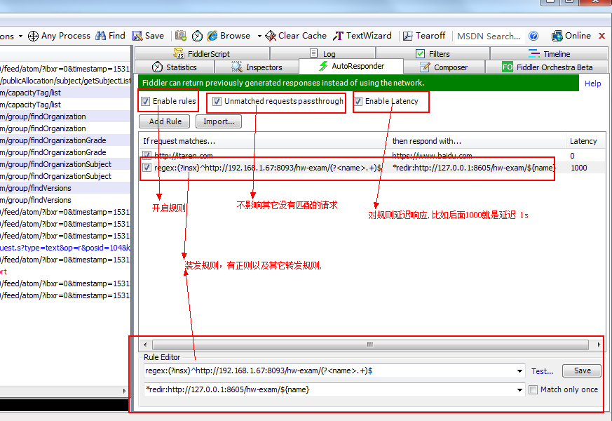

# fiddler介绍 

> 抓包工具,简单小巧,功能强大,还是不明白自己百度去,
>
> 这里说一下我开发时是怎么使用到fiddler的及对其功能理解

[推荐一个地址](http://www.360doc.com/content/15/1102/16/19017656_510224419.shtml)

[地址2](https://blog.csdn.net/linyuchen2008/article/details/52959086)

## 菜单功能

### 网络代理抓包

#### 抓取https

### 篡改请求数据

* 前置断言
* 后置断言

### 颜色的含义:

| **红色**: | 表示HTTP状态(错误)             |
| ------- | ------------------------ |
| **黄色**: | 表示HTTP状态(认证)             |
| **灰色**: | 表示数据流类型CONNECT或表示响应类型为图像 |
| **紫色**: | 表示响应类型为CSS               |
| **蓝色**: | 表示响应类型为HTML              |
| **绿色**: | 表示响应类型为script            |

### 命令

选择类：?text、>size、<size、=status、@host、  blod text、select、allbut、keeponly 

 断点类：bpafter、bps、bpv、bpm、bpu 

 控制类：hide、start、stop、show、quit 

 其他：cls/clear、dump、g/go、help、urlreplace 

例如：?text 高亮选中会话后，shift + delete 即可反选删除，这样就过滤除了你要的 session 请求。 

### 列表上对应快捷键的使用:

| SPACEBAR         | 在视图中激活并显示当前的session                  |
| ---------------- | ------------------------------------ |
| CTRL+A           | 选中所有的session                         |
| ESC              | 取消选择所有的session                       |
| CTRL+I           | 反向选中:取消选中的session,选中之前未选中的session    |
| CTRL+X           | 删除所有session                          |
| DELETE           | 删除选中的session                         |
| SHIFT+DELETE     | 删除所有未选中的session                      |
| R                | 重新执行当前请求                             |
| SHIFT+R          | 多次执行当前的请求(次数在后续的提示框中可以输入)            |
| U                | 无条件的重新执行当前的请求                        |
| SHIFT+U          | 无条件的多次重新执行当前的请求(次数在后续的提示框中可以输入)      |
| P                | 选中触发该请求的父请求                          |
| C                | 选中该响应触发色所有子请求                        |
| D                | 选中和当前session使用了相同请求方法和UR;的所有”重复”的请求  |
| ALT+ENTER        | 查看当前session的属性                       |
| SHIFT+ENTER      | 在新的FIDDLER窗口中启动该session的inspectors   |
| CTRL+1/2/3/4/5/6 | 把选中的session分别用粗体的红色/蓝色/金色/绿色/橙色/紫色表示 |
| M                | 给选中的session添加描述                      |

## 右侧功能介绍

### Statistics(统计)

### Inspectors(请求)

### AutoResponder(重定向规则)

> 可以根据请求规则定义不同的服务器,方便解决问题

* 前后端分离,前端程序到服务器,让前端地址指向本地跑的程序

  

* regex:(?insx)^http://192.168.1.67:8093/hw-exam/(?<name>.+)$ 

* *redir:http://127.0.0.1:8605/hw-exam/${name}

### Composer(模拟请求)

### fiddler orchestra beta

### FiddlerScript

### log

### filters(过滤请求) 

### TimeLine