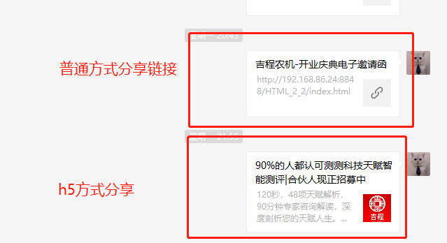

### 


#### 实现效果




#### 准备条件

1. 微信认证过的公众号:必须是经过认证的，没有认证的或者认证过期的都不可以；
2. 经过备案的域名：必须是备案过的，不然是无法使用的
3. 服务器，部署运行写好的程序前后端


#### 步骤:


##### 步骤1 .  微信公众号设置必要条件

	* 获取公众号的 appId以及secret
	* 设置绑定域名
	* 设置ip白名单


##### 步骤2.  后端请求微信授权

* 根据appid和 secret请求 access_token

* 根据access_token获取 ticket

* access_token和ticket有效时间都是7200秒=2h

* 加密数据并且返回前端

* 部署后台程序 （宝塔python项目管理器部署）

  

##### 步骤3. 前端页面集成微信分享


* 引入前端js
* 请求后台授权
* 部署前端网站 (推荐宝塔部署)


#### 代码


##### 后端

``` python

# coding:utf-8 

import requests,time
from fastapi import FastAPI
from fastapi.middleware.cors import CORSMiddleware
import uvicorn

app = FastAPI()

# 
# 后台使用地址: https://developers.weixin.qq.com/doc/offiaccount/Basic_Information/Get_access_token.html
# 前端调用地址: https://developers.weixin.qq.com/doc/offiaccount/OA_Web_Apps/JS-SDK.html#62
# pip install uvicorn
# uvicorn fastApi1:app --reload //运行 或者直接运行main方法
# http://127.0.0.1:8000/docs    //交互文档
# http://127.0.0.1:8000/redoc  //API文档

appid = '******'
secret = '******'

tmp_token = None
tmp_ticket = None
tmp_timestamp = None

referer = {
        'User-Agent':'Mozilla/4.0 (compatible; MSIE 6.0; Windows NT 5.1)',
        'Referer':'http://192.168.1.67:8093',
        'Accept-Encoding': 'gzip, deflate',
        'Accept-Language': 'zh-CN,zh;q=0.9'
}

origins = [
    "*",
    "http://localhost",
    "http://localhost:8080",
    "http://127.0.0.1:8848"
]

app.add_middleware(
    CORSMiddleware,
    allow_origins=origins,  # 允许访问的源
    allow_credentials=True,  # 支持 cookie
    allow_methods=["*"],  # 允许使用的请求方法
    allow_headers=["*"]  # 允许携带的 Headers
)

@app.get("/")
def read_root():
    return {"Hello": "World2232"}


@app.get("/getShareWechatMsg")
def getShareWechatMsg():

    token = requestToken()
    tipicet = requestTicket(token)
    nonceStr = '123321'
    timestamp = int(time.time())
    url = 'http://yoururl/index.html'

    disignSha,str = disignSha1(ticket=tipicet,nonceStr=nonceStr,timestamp=timestamp,url=url)

    return {
        "appId":appid,
        "nonceStr":nonceStr,
        "signature":disignSha,
        "timestamp":timestamp,
        "url": url,
        "str":str
    }


def requestToken():
    """
    请求 token,7200=2h后失效
    """
    global tmp_token,tmp_timestamp,tmp_ticket
    if not(tmp_token is None) and not(tmp_timestamp is None) and (tmp_timestamp + 1*60*60) > int(time.time()):
        print('重复请求...')
        return tmp_token

    cur_url= 'https://api.weixin.qq.com/cgi-bin/token?grant_type=client_credential&appid=%s&secret=%s'%(appid,secret)
    resp = requests.get(url=cur_url,headers=referer,verify=False).json();
    print('resp',resp)
    tmp_token = resp['access_token']
    tmp_timestamp = int(time.time())
    tmp_ticket = None
    return tmp_token


def requestTicket(access_token):
    """
    用token请求Ticket,7200=2h后失效
    """
    global tmp_ticket
    if not(tmp_ticket is None):
        print('重复请求 tmp_ticket...')
        return tmp_ticket
    cur_url = 'https://api.weixin.qq.com/cgi-bin/ticket/getticket?type=jsapi&access_token=%s'%access_token
    resp = requests.get(url=cur_url,headers=referer,verify=False).json();
    print('resp',resp)
    tmp_ticket = resp['ticket']
    return tmp_ticket

def disignSha1(ticket='1',nonceStr='2',timestamp=int(time.time()),url='4'):
    str = 'jsapi_ticket=%s&noncestr=%s&timestamp=%s&url=%s'%(ticket,nonceStr,timestamp,url)
    #str = 'jsapi_ticket=kgt8ON7yVITDhtdwci0qeeJrV_tzKLeUb6f04r3D-wSnxclxSKgkkuN3EZaRwDCKkq9KBbJuk6K1E7dNrsD0tg&noncestr=123321&timestamp=1641821259&url=http://www.baidu.com/'
    import hashlib
    sha = hashlib.sha1(str.encode('utf-8'))
    encrypts = sha.hexdigest()
    print(str)
    print(encrypts)
    return encrypts,str

if __name__ == '__main__':
    uvicorn.run("test7:app",host="0.0.0.0",port=8000,reload=True,workers = 2);
    print("程序启动完成");
    pass


```


###### 前端

```` html

<!DOCTYPE html>
<html>
	<head>
		<meta charset="utf-8" />
		<title>吉程农机-开业庆典电子邀请函</title>
		<meta name="viewport" content="width=device-width, initial-scale=1, minimum-scale=1, maximum-scale=1" />
		<!-- css -->
		<link rel="stylesheet" href="css/style.css" />
		<script type="text/javascript" src="js/font_size.js"></script>
		<link href="http://cdn.repository.webfont.com/webfonts/nomal/104604/47006/61d4045cf629d812c06e0d74.css" rel="stylesheet"  />
		<!-- 拨号权限 -->
		<meta name="format-detection" content="telephone=yes" />
		
		
		<!-- 引入微信接口文件 -->
		<script type="text/javascript" src="http://res.wx.qq.com/open/js/jweixin-1.6.0.js"></script>
		<!-- 引入jquery -->
		<script type="text/javascript" src="https://code.jquery.com/jquery-3.0.0.min.js"></script>
		
		<script type="text/javascript">
			// https://www.cnblogs.com/hejun26/p/9894742.html
			console.log('wx---');
			console.log(wx);
			
			$(function() {
			    //对url进行编码
			    var localUrl = encodeURIComponent(location.href.split('#')[0]);
			    //url传到后台格式
			    var Url = "URL=" +localUrl;
			    //这几个参数都是后台从微信公众平台获取到的
			    var nonceStr, signature, timestamp, appId, shareUrl;
				console.log('request before ... ');
				
				let url = "http://127.0.0.1:8000/getShareWechatMsg";
				let img_url = "http://127.0.0.1/images/logo.png";
				 				
				$.get(url,function(data,status){
				    share(data);
				});
				
				function share(data){
					console.log('request success:',data);
					//得到参数
					var appId = data.appId;
					var nonceStr = data.nonceStr;
					var signature = data.signature;
					var timestamp = data.timestamp;
					var shareUrl = data.url;
					//通过微信config接口注入配置
					wx.config({
					    debug: false, // 默认为false  为true的时候是调试模式，会打印出日志
					    appId: appId,
					    timestamp: timestamp,
					    nonceStr: nonceStr,
					    signature: signature,
					    jsApiList: [
					        //'checkJsApi',
					        //'onMenuShareTimeline',
					        'onMenuShareAppMessage',
					        //'onMenuShareQQ',
					        //'onMenuShareWeibo'
					    ]
					});
					//配置自定义分享内容
					window.share_config = {
					    'share': {
					        'imgUrl': img_url, // 这里是需要展示的图标
					        'desc': '湖南吉程农机科技股份有限公司成立于2013年5月，公司位于湖南省湘西土家族苗族自治州龙山县工业集...', // 这是分享展示的摘要
					        'title': '吉程农机-开业庆典电子邀请函', // 这是分享展示卡片的标题
					        'link': shareUrl, // 这里是分享的网址
					        'success': function(rr) {
					            console.log('成功' + JSON.stringify(rr))
					        },
					        'cancel': function(tt) {
					            console.log('失败' + JSON.stringify(tt));
					        }
					    }
					};
					wx.ready(function() {
					    wx.onMenuShareAppMessage(share_config.share); // 微信好友
					    //wx.onMenuShareTimeline(share_config.share); // 微信朋友圈
					    //wx.onMenuShareQQ(share_config.share); // QQ
						document.getElementById('msc').play();
					});
								
				}
				 
			})
			
			//播放背景音乐问题 https://blog.csdn.net/qq_33894301/article/details/54288967
			document.addEventListener('DOMContentLoaded',function (){
			    function audioAutoPlay(){
			        var audio_ = document.getElementById('msc');
			            audio_.play();
			        document.addEventListener("WeixinJSBridgeReady", function () {
			                audio_.play();
			        }, false);
			    }
			    audioAutoPlay();
			});
		</script>
		
		
	</head>
	<body>
		
		
		 

		<audio  autoplay="autoplay" id="msc" loop="loop">
		  <source src="bj.mp3" type="audio/ogg">
		  <source src="bj.mp3" type="audio/mpeg">
			您的浏览器不支持 audio 元素。
		</audio>
		
	</body>
</html>


````


### [代码地址](https://gitcode.net/github_33764133/WechatShare)

